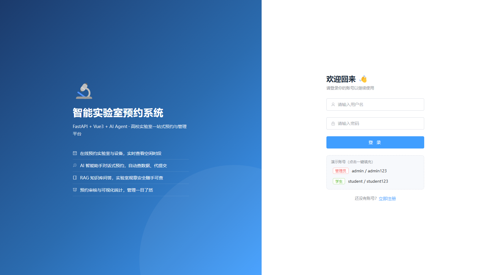
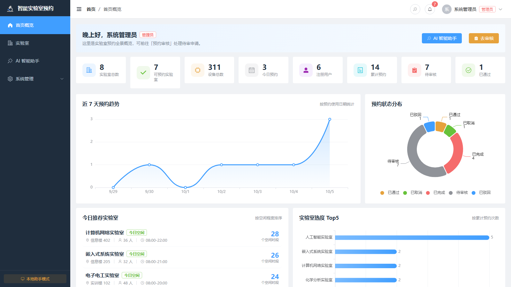
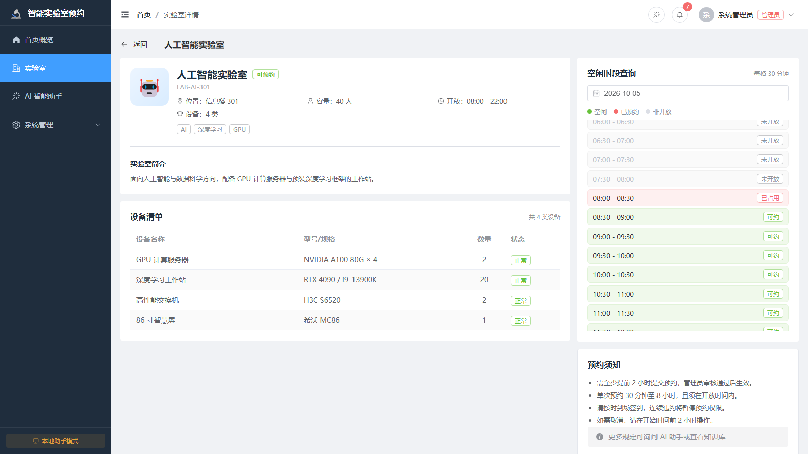
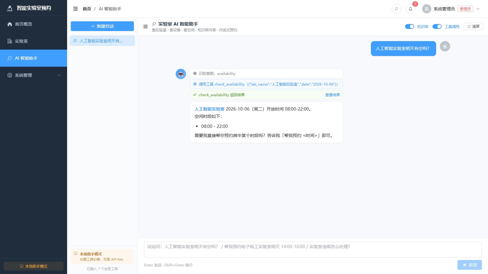
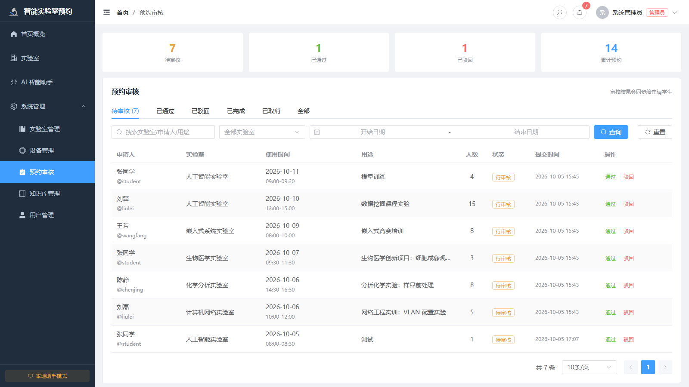
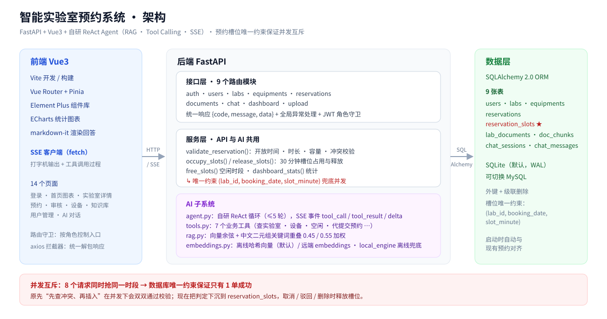

# 🔬 智能实验室预约系统

> FastAPI + Vue3 的高校实验室一站式预约与管理系统
> 内置**自研 ReAct Agent**：RAG 知识库 · Tool Calling · SSE 流式“过程可见”
> 预约时段采用 **30 分钟粒度槽位 + 数据库唯一约束**，并发下不会重复预约

---

## 一、项目来源与我的贡献

本项目的功能清单与实现思路参考了公开课程
（青戈 AI 小栈《FastAPI + LangGraph 从零开发智能实验室预约系统》），
在此基础上由我逐模块落地，并做了下列改造。**这些改造是本仓库与课程原版的主要差异，也是我认为最值得看的部分：**

- **并发正确性**：新增 `reservation_slots` 预约槽位表，把“同一实验室 + 同日期 + 时间段重叠”的判定
  下沉为数据库唯一约束 `(lab_id, booking_date, slot_minute)`。原先“先查冲突、再插入”的写法在并发下会
  同时通过校验、双双写入；现在同一时段即使 8 个请求同时提交，也只有 1 单能成功（见第六节）。
- **自研 ReAct 循环替代 LangGraph**：环境内 `langgraph` 与 `langchain-core` 版本冲突不可用，
  改为手写 Agent 循环（最多 5 轮），从而能按 `tool_call` / `tool_result` 粒度控制 SSE 事件，
  前端可以实时展示“调用了哪个工具、参数与返回值”。
- **统一校验口径**：`services.validate_reservation()` 同时被 REST 接口与 AI 工具调用，
  保证“页面下单”和“自然语言下单”的规则完全一致。
- **双模式降级**：未配置 API Key 或模型异常时自动切换到本地意图引擎，且与大模型模式**复用同一套工具层**，
  离线状态下依然能真实查库、校验冲突、提交预约。
- **离线向量检索**：内置确定性哈希向量（字符 n-gram + TF），无需下载模型或联网即可演示 RAG；
  配置 `EMBEDDING_API_KEY` 后自动优先使用远端 embeddings。
- **测试与交付**：60 项接口冒烟测试（含并发抢约、权限隔离、冲突检测、RAG、SSE 事件流），
  前端构建产物校验脚本，单进程部署（后端直接托管前端静态资源）。

---

## 二、功能一览

### 1. 业务系统

| 模块 | 能力 |
|------|------|
| 认证 | 登录 / 注册 / JWT 鉴权 / 角色权限（管理员、学生） |
| 用户管理 | 列表分页搜索、增删改、启用禁用、个人资料、修改密码、头像上传 |
| 实验室管理 | 增删改查、楼栋/状态/容量筛选、开放时间、状态（可预约/维护中/停用） |
| 设备管理 | 设备增删改查、按实验室与状态筛选、正常/维修/报废 |
| 预约管理 | 提交预约、**时间冲突检测**、开放时间校验、取消、修改、管理员审核 |
| 我的预约 | 按状态分组查看、审核意见、取消预约 |
| 预约审核 | 待审列表、通过/驳回、自动驳回冲突申请、审核意见 |
| 数据统计 | 7 天趋势、状态分布、实验室热度、今日推荐、个人预约概况 |
| 知识库 | 文档增删改、自动切片向量化、检索测试、重建索引 |

### 2. AI 智能助手

| 能力 | 说明 |
|------|------|
| **Tool Calling** | 7 个业务工具：查实验室、查详情、查设备、查空闲、**代提交预约**、查我的预约、查知识库 |
| **RAG 知识库** | 内置实验室规章制度/安全须知/操作规范 11 篇，向量检索 + 关键词重叠加权 |
| **ReAct Agent** | 思考 → 调用工具 → 观察结果 → 生成回答，最多 5 轮，可串联多个工具 |
| **SSE 流式输出** | 逐字输出 + **过程可见**（实时展示调用了哪个工具、参数与返回结果） |
| **双模式运行** | 配置 API Key → 大模型驱动；不配置 → **本地助手引擎**，功能不缺失 |
| 会话管理 | 多会话、历史记录、删除会话 |

### 3. 界面

登录页 / 首页概览（ECharts 图表）/ 实验室卡片与详情（30 分钟粒度空闲时间轴）/
预约申请 / 我的预约 / 预约审核 / 设备管理 / 知识库管理 / 用户管理 / 个人中心 / AI 对话页。

| 登录 | 首页概览 |
|------|----------|
|  |  |

| 实验室详情 · 30 分钟空闲时间轴 | AI 助手 · 工具调用过程可见 |
|------|----------|
|  |  |

| 预约审核 | |
|------|------|
|  | |

> 重新截图或替换素材的方法见 [`docs/images/README.md`](docs/images/README.md)。

---

## 三、系统架构



**分层说明**

- **前端**：Vue3 + Vite + Pinia + Element Plus + ECharts；`fetch` 读取 SSE 事件流实现打字机与工具过程展示。
- **接口层**：9 个路由模块（auth / users / labs / equipments / reservations / documents / chat / dashboard / upload），
  统一 `{code, message, data}` 响应格式与全局异常处理。
- **服务层**：序列化、预约校验、空闲时段、统计，以及并发互斥的**槽位占用与释放**。
- **AI 子系统**：`agent`（ReAct 循环）→ `tools`（7 个业务工具）→ `rag`（混合检索）→ `embeddings`（离线/远端）；
  `local_engine` 负责离线兜底。
- **数据层**：SQLAlchemy 2.0 ORM，默认 SQLite（开箱即用），可切换 MySQL。

---

## 四、快速开始

### 环境要求

- **Python 3.10+**（已在 3.12 验证）
- **Node.js 18+**（已在 24 验证）
- 无需数据库服务：默认使用 SQLite

### 1. 启动后端

```bash
cd backend
pip install -r requirements.txt        # 首次
python -m uvicorn app.main:app --host 127.0.0.1 --port 8000 --reload
```

首次启动会自动建表、写入演示数据（6 个账号、8 间实验室、32 条设备记录共 311 件、
11 篇知识库文档、12 条预约记录），并对齐预约槽位索引。

- API 文档：<http://127.0.0.1:8000/docs>
- 健康检查：<http://127.0.0.1:8000/api/health>

### 2. 启动前端

```bash
cd frontend
npm install                            # 首次
npm run dev
```

访问 <http://127.0.0.1:5173>

> 受限环境（无法运行 esbuild）请用 `npm run dev:sandbox`；`npm run build` 会自动在
> “标准 Vite”和“无 esbuild 构建”之间选择，详见 [docs/development.md](docs/development.md)。

### 3. 演示账号

| 角色 | 用户名 | 密码 | 说明 |
|------|--------|------|------|
| 管理员 | `admin` | `admin123` | 全部权限，可审核预约、管理实验室/设备/用户/知识库 |
| 教师(管理员) | `teacher` | `teacher123` | 同上 |
| 学生 | `student` | `student123` | 预约、查看我的预约、使用 AI 助手 |
| 学生 | `wangfang` / `liulei` / `chenjing` | `123456` | 用于演示多用户预约与冲突 |

### 4. 单进程部署（可选）

前端构建后，后端会自动托管静态页面，只需启动后端一个进程：

```bash
cd frontend && npm run build
cd ../backend && python -m uvicorn app.main:app --port 8000
```

访问 <http://127.0.0.1:8000> 即可。

---

## 五、接入大模型（可选）

不配置也能完整使用（走本地助手引擎）。要接入真实大模型，复制配置并填写：

```bash
cd backend
cp .env.example .env
```

编辑 `.env`：

```ini
LLM_API_KEY=sk-xxxxxxxx
LLM_BASE_URL=https://api.deepseek.com/v1
LLM_MODEL=deepseek-chat
```

常见 OpenAI 兼容服务：

| 服务 | LLM_BASE_URL | LLM_MODEL |
|------|--------------|-----------|
| DeepSeek | `https://api.deepseek.com/v1` | `deepseek-chat` |
| 通义千问 | `https://dashscope.aliyuncs.com/compatible-mode/v1` | `qwen-plus` |
| 智谱 GLM | `https://open.bigmodel.cn/api/paas/v4` | `glm-4-flash` |
| 月之暗面 | `https://api.moonshot.cn/v1` | `moonshot-v1-8k` |
| 本地 Ollama | `http://localhost:11434/v1` | `qwen2.5:7b` |
| OpenAI | `https://api.openai.com/v1` | `gpt-4o-mini` |

重启后端后，左侧栏底部与 AI 助手页会显示「大模型模式」。可访问
`GET /api/dashboard/ai-status` 查看当前模式、向量化后端与工具清单。

> 该接口只依赖标准 OpenAI 兼容协议，因此换任何厂商都不需要改代码；
> 知识库向量化默认使用**内置离线向量**，无需下载模型，也可通过
> `EMBEDDING_API_KEY` / `EMBEDDING_BASE_URL` 切换到远端 embeddings。

> ⚠️ 上线前请在 `.env` 中把 `SECRET_KEY` 换成随机字符串，把 `DEBUG` 设为 `false`、
> `CORS_ORIGINS` 收敛到实际域名；服务在 `DEBUG=false` 且仍使用默认密钥时会拒绝启动。

---

## 六、并发正确性（重点）

### 问题

预约冲突判断原本是“先查询是否有重叠，再插入新预约”。单线程下没问题，但两个请求同时执行时，
双方都会查到“无冲突”，然后各自插入成功 —— 同一个实验室、同一时段会被重复预约。
这与商城项目里的“超卖”是同一类竞态。

### 方案

1. 每条有效预约（`pending` / `approved`）按 **30 分钟粒度**占用若干槽位，写入 `reservation_slots` 表；
2. `(lab_id, booking_date, slot_minute)` 建唯一约束，**由数据库保证互斥**；
3. 取消 / 驳回 / 删除 / 完成时释放槽位，修改预约时先释放旧槽位再占用新槽位（同一事务，失败自动回滚）；
4. 服务启动时自动把槽位表与现有预约对齐，兼容旧数据。

起点向下取整让判定只会更保守（例如 14:10-14:40 占用 14:00 与 14:30 两个槽位），
因此不会漏判重叠，只会更早拦截。

### 验证

`backend/scripts/smoke-test.mjs` 中的并发用例会**同时发起 8 个抢同一时段的请求**，
断言恰好 1 单成功、其余全部被拒：

```bash
cd backend
node scripts/smoke-test.mjs        # 需先启动后端
```

---

## 七、AI 助手能做什么

直接对话即可，例如：

```
学校有哪些实验室？分别在哪里？
人工智能实验室明天有空吗？
GPU 服务器在哪个实验室？有几台？
实验室安全规定有哪些？进入实验室要穿实验服吗？
帮我预约电子电工实验室明天 14:00-16:00 用于电路实验，6个人
我的预约审核通过了吗？
```

**过程可见**效果：回答前会实时展示

```
🔧 调用工具 check_availability（{"lab_name":"人工智能实验室","date":"2026-10-06"}）
✅ check_availability 返回结果        [查看结果]
💭 正在分析问题并规划调用哪些工具…
```

### 双模式机制

| | 大模型模式 | 本地助手模式（默认） |
|---|---|---|
| 触发条件 | 配置了 `LLM_API_KEY` | 未配置或模型不可用 |
| 意图理解 | LLM 自主规划与 Tool Calling | 内置意图识别 + 参数抽取引擎 |
| 工具层 | **完全相同** | **完全相同** |
| 流式输出 | 模型逐 token | 按句切分模拟打字机 |
| 依赖 | 需要网络/API Key | 完全离线 |

两种模式共用同一套 `app/ai/tools.py` 工具层，因此**离线时依然能真实查询数据库、校验冲突并提交预约**。

---

## 八、数据库设计

| 表 | 说明 | 关键字段 |
|----|------|----------|
| `users` | 用户 | username、password(bcrypt)、role、student_no、is_active |
| `labs` | 实验室 | name、code、building/room、capacity、open_time/close_time、status |
| `equipments` | 设备 | lab_id、name、model、quantity、status |
| `reservations` | 预约 | user_id、lab_id、booking_date、start/end_time、status、reviewer_id |
| `reservation_slots` | **预约槽位（并发互斥）** | lab_id、reservation_id、booking_date、slot_minute，唯一约束 |
| `lab_documents` | 知识库文档 | title、category、content、lab_id |
| `doc_chunks` | 文档切片与向量 | document_id、content、embedding(JSON) |
| `chat_sessions` / `chat_messages` | AI 会话与消息 | role、content、tool_name/tool_args/tool_result |

预约状态流转：`pending → approved → finished`，或 `pending → rejected`，`pending/approved → cancelled`。

**冲突检测规则**：同实验室 + 同日期 + 状态有效（pending/approved）+ 时间段重叠 → 拒绝，
在 API 与 AI 工具中走同一套 `services.validate_reservation()`，并由 `reservation_slots` 唯一约束兜底并发。

---

## 九、API 概览

统一响应格式：

```json
{ "code": 200, "message": "操作成功", "data": { } }
```

业务错误通过 `code` 区分（400 参数、401 未登录、403 无权限、404 不存在、409 冲突、500 服务端）。

| 分组 | 主要接口 |
|------|----------|
| 认证 | `POST /api/auth/login`、`POST /api/auth/register`、`GET /api/auth/me` |
| 用户 | `GET/POST /api/users`、`PUT/DELETE /api/users/{id}`、`PUT /api/users/profile/me`、`PUT /api/users/password/me` |
| 实验室 | `GET/POST /api/labs`、`GET/PUT/DELETE /api/labs/{id}`、`GET /api/labs/{id}/availability` |
| 设备 | `GET/POST /api/equipments`、`PUT/DELETE /api/equipments/{id}` |
| 预约 | `GET/POST /api/reservations`、`PUT /api/reservations/{id}/cancel`、`PUT /api/reservations/{id}/review`、`GET /api/reservations/stats` |
| 知识库 | `GET/POST /api/documents`、`POST /api/documents/search`、`POST /api/documents/reindex` |
| AI | `POST /api/chat`、`POST /api/chat/stream`(SSE)、`GET /api/chat/sessions` |
| 统计 | `GET /api/dashboard/stats`、`GET /api/dashboard/ai-status` |
| 上传 | `POST /api/upload/image` |

完整交互式文档：<http://127.0.0.1:8000/docs>

---

## 十、测试

```bash
cd backend
node scripts/smoke-test.mjs        # 后端启动后执行
```

覆盖认证、权限隔离、实验室/设备、预约冲突与开放时间校验、审核流程、**并发抢约**、
RAG 检索、AI 工具调用与代提交预约、SSE 事件流、增删改闭环等 **60 项断言**，
并在结束时还原被修改的演示数据。

前端构建后建议再跑一次产物校验（可提前发现“构建成功但浏览器白屏”的问题）：

```bash
cd frontend
npm run build
node scripts/verify-bundle.cjs
```

---

## 十一、项目结构

```
Laboratory Reservation System/
├── backend/
│   ├── app/
│   │   ├── main.py              # 应用入口、路由注册、静态托管、启动时对齐槽位索引
│   │   ├── config.py            # 配置（.env 加载 + 密钥校验）
│   │   ├── database.py          # 引擎、会话、建表（SQLite 开启 WAL 与外键）
│   │   ├── models.py            # 9 张表 ORM 模型（含 reservation_slots）
│   │   ├── schemas.py           # Pydantic 请求/响应模型
│   │   ├── services.py          # 序列化 + 预约校验 + 槽位占用/释放 + 统计（API 与 AI 共用）
│   │   ├── seed.py              # 演示数据与知识库初始化
│   │   ├── core/                # 统一响应、业务异常、JWT/bcrypt
│   │   ├── api/                 # 9 个路由模块
│   │   └── ai/
│   │       ├── agent.py         # 自研 ReAct 循环 + SSE 事件流
│   │       ├── tools.py         # 7 个业务工具（Tool Calling）
│   │       ├── rag.py           # 切片、索引、混合检索
│   │       ├── embeddings.py    # 离线哈希向量 + 远端向量
│   │       ├── local_engine.py  # 本地助手引擎（离线兜底）
│   │       └── llm.py           # OpenAI 兼容客户端
│   ├── scripts/smoke-test.mjs   # 60 项接口冒烟测试（含并发抢约）
│   ├── requirements.txt
│   └── .env.example
├── frontend/
│   ├── src/                     # api / router / store / layout / utils / views（14 个页面）
│   └── scripts/                 # 构建与校验脚本（标准构建 + 受限环境降级）
├── docs/
│   ├── architecture.svg         # 架构图
│   ├── development.md           # 开发与构建说明（含受限环境处理）
│   └── images/                  # 界面截图（登录 / 首页 / 实验室详情 / AI / 审核）
└── README.md
```

---

## 十二、技术选型说明

课程原方案为 **LangChain + LangGraph + Chroma**。本项目在保持同等能力与架构思想的前提下，
按实际可用的依赖环境做了等价实现，并在代码注释中标注：

| 课程方案 | 本项目实现 | 原因 |
|----------|-----------|------|
| LangGraph 编排 | `ai/agent.py` 自研 ReAct 状态循环 | 环境内 langgraph 1.2.9 与 langchain-core 0.1.23 版本冲突；自研循环可精确控制 SSE 事件粒度 |
| LangChain Tool Calling | `ai/tools.py` + OpenAI 兼容 SDK | 工具层设计一致，可无缝迁移 |
| Chroma 向量库 | `doc_chunks` 表 + 余弦相似度 | 避免模型下载（无外网）；接口一致，文档量大时可切回 Chroma |
| OpenAI Embeddings | 内置哈希向量（字符 n-gram + TF） | 无需外网即可演示 RAG；配置 key 后自动优先使用远端 embeddings |
| pydantic-settings | `config.py` 自带 .env 加载 | 环境内 pydantic-settings 与 pydantic 2.5.2 不兼容 |
| aiosqlite 异步 | 同步 SQLAlchemy 2.0 + 线程池 | 环境未提供 aiosqlite；FastAPI 对 `def` 路由自动使用线程池 |
| passlib | 直接调用 bcrypt | 减少一层依赖，行为一致 |

---

## 十三、常见问题

**Q：AI 助手回答「知识库里没有相关内容」？**
A：确认 `GET /api/documents/stats` 的 `chunks > 0`；若为 0，调用 `POST /api/documents/reindex` 重建索引。

**Q：如何切换成 MySQL？**
A：`pip install pymysql`，在 `.env` 中设置
`DATABASE_URL=mysql+pymysql://root:密码@127.0.0.1:3306/lab_booking?charset=utf8mb4`，重启即可。
槽位唯一约束在 MySQL 上同样生效。

**Q：上传的图片存在哪里？**
A：默认 `backend/uploads/images/`，通过 `/uploads/images/<文件名>` 访问，可用 `.env` 的 `UPLOAD_DIR` 修改。

**Q：如何清空演示数据重新开始？**
A：删除 `backend/data/lab_booking.db`，重启后端会自动重新初始化。

**Q：开发环境 / 构建脚本的说明在哪？**
A：见 [docs/development.md](docs/development.md)。
